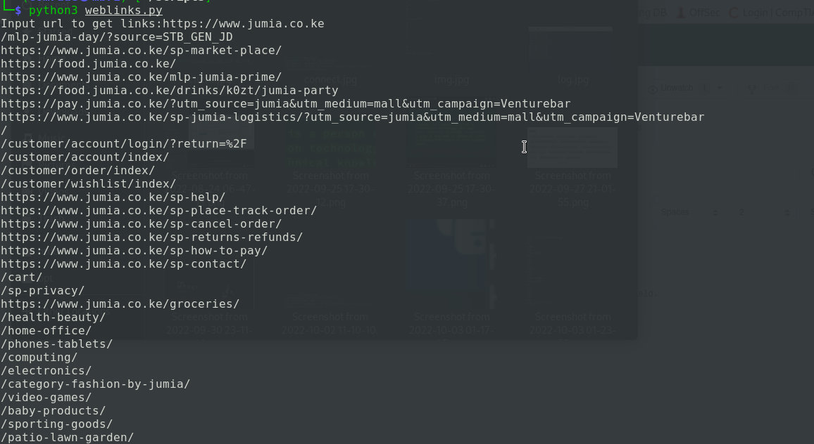

# Py-Link-extractor
This script extracts all links associated to the main domain/website link.

-This script helps to get all links of a given site this good for enumeration and expansion of target's field.

-To run it just clone the repo and run `python3 weblinks.py` to get the links.

-Let's try to run this against an online shopping site `https://www.jumia.co.ke`

### NB:This script can be improved to bring about browser automation ie blending it preferred installer program such as selenium.
